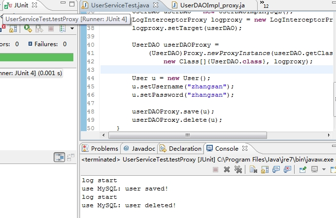
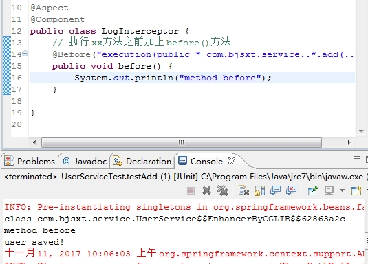

AOP--OOP

* OOP(面向对象编程)针对业务处理过程的实体及其属性和行为进行抽象封装，以获得更加清晰高效的逻辑单元划分。

* AOP(面向切面编程)则是针对业务处理过程中的切面进行提取，它所面对的是处理过程中的某个步骤或阶段，以获得逻辑过程中各部分之间低耦合性的隔离效果。

---

例如： 想在所有DAO的实现方法中加上业务逻辑（如日志信息)：

* 可以直接修改原方法(要改动原来的代码)

* 可以通过继承的方式（新增类，在配置文件中改成新继承的类）

* 组合的方式（新增类，组合其它已有类，然后在配置文件中修改）如下

```java
// 具体的数据库存储操作实现
public class UserDAOImpl3 implements UserDAO {

	public UserDAO userDao = new UserDAOImplMySQL();
	//public UserDAO userDao = new UserDAOImplSqlServer();

	public void save(User user) {
		System.out.println("log start...");
		userDao.save(user);
		//System.out.println("use Sql Server: user saved!");
	}


}
```


## 把日志逻辑单独抽取出来称为一个新的类，每次new一个日志类（或者写成单例类）


```java
public class LogInterceptor {
	
	public void beforeMethod(){
		System.out.println("log start");
	}

}
```

```java
// 具体的数据库存储操作实现
public class UserDAOImpl_zuhe implements UserDAO {

	public UserDAO userDao = new UserDAOImplMySQL();
	
	public void save(User user) {
		//System.out.println("save start...");
		
		new LogInterceptor().beforeMethod();
		
		userDao.save(user);
		//System.out.println("use Sql Server: user saved!");
	}

}
```


**如果类有1k个方法，每个方法都是同样的加日志逻辑，那么这种继承或组合的方法，要累死，需要重写这1k个方法；并且可以发现，代码冗余是很大的**

## 动态代理

```java
package com.aop;

import java.lang.reflect.InvocationHandler;
import java.lang.reflect.Method;

public class LogInterceptorProxy implements InvocationHandler{
	
	// 被代理的对象
	private Object target;
	
	public void beforeMethod(){
		System.out.println("log start");
	}

	@Override
	public Object invoke(Object proxy, Method m, Object[] args)
			throws Throwable {
		
		beforeMethod();
		
		m.invoke(target, args);
		
		return null;
	}

	public Object getTarget() {
		return target;
	}

	public void setTarget(Object target) {
		this.target = target;
	}

	
}

```

测试如下：

```java
@Test
public void testProxy() throws Exception {
    
    UserDAO userDAO = new UserDAOImplMySQL();
    LogInterceptorProxy logproxy = new LogInterceptorProxy();
    logproxy.setTarget(userDAO);
    
    UserDAO userDAOProxy = 
        (UserDAO)Proxy.newProxyInstance(userDAO.getClass().getClassLoader(),
            new Class[]{UserDAO.class}, logproxy);
        
    User u = new User();
    u.setUsername("zhangsan");
    u.setPassword("zhangsan");
    
    userDAOProxy.save(u);
    userDAOProxy.delete(u);
}
```




spring 使用




**通过设置一个 代理类，被代理的对象 交给 代理类，通过 代理类 来操作 被代理的对象**

**java的反射机制**： JAVA反射机制是在运行状态中，对于任意一个类，都能够知道这个类的所有属性和方法；对于任意一个对象，都能够调用它的任意方法和属性；这种动态获取信息以及动态调用对象方法的功能称为java语言的反射机制。


## AOP 应用

AOP主要实现的目的是针对业务处理过程中的切面进行提取，它所面对的是处理过程中的某个步骤或阶段，以获得逻辑过程中各部分之间低耦合性的隔离效果

* JDK动态代理

* 面向接口编程

面向切面： 相加就加上，不想加就不加；

* 权限：某个页面执行前 检查权限。

* 日志

* 审查

* 事务（事务start, commit）

---
**注：代码来自马士兵Spring2.5讲解，自己实践**
